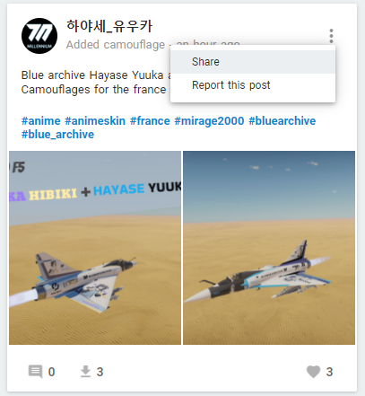
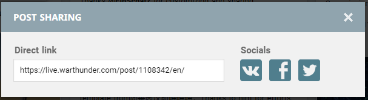

# War-Thunder-skins-manager
This repository contains a simple CLI tool I wrote to quickly install/uninstall a War Thunder camo 

## Requirements
- Have chrome installed (the scrapper uses chrome headless to retrieve the skin)

## Features
- Install a camo
- Uninstall a camo
- List all installed camos

## How to use
1. Clone the repository
2. Navigate to the repository folder with `cd War-Thunder-skins-manager`
3. Navigate to the code folder with `cd wt-skins-manager`
4. Build the cli with `cargo build --release`
5. Run the cli with `./target/release/wt-skins-manager.exe` or `cargo run --release`
6. Follow the instructions
7. In War Thunder, apply the skin from the customization menu
8. Enjoy your new camo

## How to get the camo link*
1. Go to [live.warthunder.com](https://live.warthunder.com/feed/camouflages/)
2. Find the camo you want to install
3. Click on the 3 dots on the top right corner of the camo
  
4. Click on "Share"
5. Copy the link

## Compatibility
This tool is only compatible with Windows for now but you can easily adapt it to work on Linux or MacOS by changing the path where the camo is installed and by changing the way to get the user name
